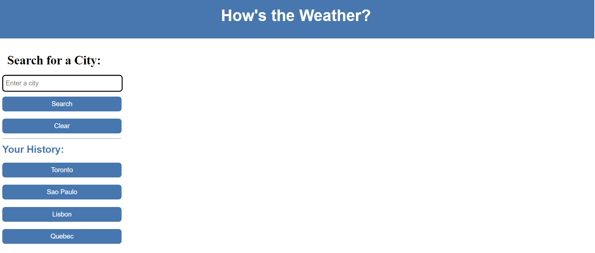
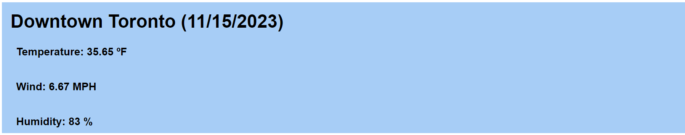
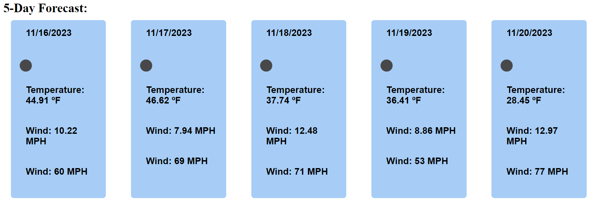

# Weather-status-board

## Description

A simple web application that shows real-time weather information and forecasts.
It retrieves data from the OpenWeather API and presents it in an easy-to-read format, providing details such as current weather conditions, temperature, humidity, and wind speed.

## Sample Application

1. Search for a city and click the search button or click. The city searched will be saved in the history so next time user can just click on the city. User can also clear history by clicking the clear button.
   

2. Current weather of the City selected.
   ">

3. The next 5 days forecast for the City selected.
   ">

## Deployment Link

[Deployment Link](https://karina-yuk.github.io/Weather-status-board/)
